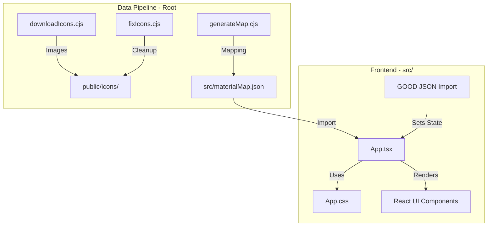

# Architecture: Genshin Planner

This document outlines the technical architecture, data flow, and design patterns of the Genshin Planner project.

## Tech Stack
- **Framework**: [Vite](https://vitejs.dev/) + [React](https://react.dev/)
- **Language**: [TypeScript](https://www.typescriptlang.org/)
- **Styling**: Vanilla CSS (Standard CSS variables for theming)
- **Icons**: [Lucide React](https://lucide.dev/)
- **Deployment**: Optimized for Static Site Hosting (GitHub Pages)

## High-Level Architecture

## Core Components

### 1. Data Pipeline (`*.cjs`)
The project relies on external game data. Several CommonJS scripts in the root handle the heavy lifting:
- `downloadIcons.cjs`: Fetches material icons from external sources.
- `generateMap.cjs`: Aggregates material metadata (rarity, sources, names) into `materialMap.json`.
- `fixIcons.cjs`: Ensures icon consistency and proper file extensions.

### 2. State Management
Currently, state is centralized in `App.tsx` using React's `useState`:
- `materials`: Stores the imported GOOD data (Material Key -> Count).
- `activeTab`: Manages navigation between Inventory, Planner, Characters, and Weapons.
- `hoveredItem`: Controls the global tooltip state.

### 3. Data Format (GOOD)
The app is built around the **Genshin Optimizer Data (GOOD)** format. 
- It maps lowercase internal keys (e.g., `creaturesurveyingnotes`) to human-readable names and game IDs via the `materialMap.json`.

## Design Patterns
- **Local-First**: All processing happens in the browser. No backend is required.
- **Dynamic Theming**: CSS variables are used for rarity-based background colors (`bg-rarity-1` through `bg-rarity-5`).
- **Lazy Mapping**: The app merges static metadata (`materialMap`) with dynamic user data (`materials`) at render time.

## Directory Structure
- `/src`: React components and styles.
- `/public`: Static assets including the processed `/icons` folder.
- `/`: Root contains configuration and data-processing scripts.
