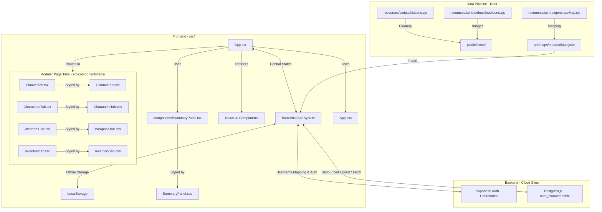

# Architecture: Genshin Planner

This document outlines the technical architecture, data flow, and design patterns of the Genshin Planner project.

## Tech Stack
- **Framework**: [Vite](https://vitejs.dev/) + [React](https://react.dev/)
- **Language**: [TypeScript](https://www.typescriptlang.org/) (Strictly-typed interfaces)
- **Styling**: Vanilla CSS (Component-scoped stylesheets + global variable tokens)
- **Icons**: [Lucide React](https://lucide.dev/)
- **Database & Auth**: [Supabase](https://supabase.com/) (Auth & PostgreSQL Database with JSONB support)
- **Deployment**: Optimized for Static Site Hosting (GitHub Pages) with CI/CD environment integration
- **Testing**: [Vitest](https://vitest.dev/) (Lightweight, zero-config TypeScript unit testing suite)

## High-Level Architecture

## Core Components

### 1. Data Pipeline (`resources/scripts/*.cjs`)

- `resources/scripts/downloadIcons.cjs`: Fetches material icons from external sources.
- `resources/scripts/generateMap.cjs`: Aggregates material metadata (rarity, sources, names) into `src/maps/materialMap.json`.
- `resources/scripts/fixIcons.cjs`: Ensures icon consistency and proper file extensions.

### 2. State & Sync Custom Hook (`src/hooks/useAppSync.ts`)

Centralizes data retrieval, authentication states, and dual-persistence mechanisms:
- **Authentication State**: Manages active user profile login states (`user`, `setUser`) and Supabase sessions.
- **Offline Guest Mode**: When the user is logged out, the hook automatically reads and writes configurations locally under the unified Local Storage namespace key `genshin_planner_local_data`.
- **Supabase Cloud Sync Mode**: When signed in, the hook connects to the Supabase client, fetches profile lists, tracks profile switcher indices, and handles debounced auto-saving to PostgreSQL.
- **Legacy Profiles Migration**: Transparently handles the transformation of character-only data by appending `type: "character"` and converting them to the sequential `plannedItems` format.

### 3. Modular Page Tabs (`src/components/tabs/`)

Separates the page views to eliminate the giant inline layout switches inside the root file:
- **`<InventoryTab>`**: Handles material inventory filtering, sorting, category filtering, and item count bindings. Materials are sourced entirely from `materialMap.json` (not the imported state), so all known materials appear even with zero counts. Sorting cascades `sortGroup` → `sortRank` → `rarity (descending)`. A category `<select>` dropdown filters by `sortGroup`. Import is scoped strictly to the `materials` key of a GOOD file. The "Clear Inventory" action uses a custom `ClearInventoryConfirmationModal`. Styled by its own isolated `InventoryTab.css`.
- **`<CharactersTab>`**: Handles character filters (elements, weapons, star rarities), sorting lists, and Owned character cards. Styled by `CharactersTab.css`.
- **`<WeaponsTab>`**: Manages name filtering, star selection grids, category silhouettes, and character weapon equips. Styled by `WeaponsTab.css`.
- **`<PlannerTab>`**: Encapsulated the main drag-and-drop planned grid, levels/talents transition rows, power standby states, and modal trigger props. Styled by `PlannerTab.css`.

### 4. Stylesheet Decomposition & Variables (`src/App.css`)
- Component styling is strictly modularized into **5 dedicated CSS stylesheets** stored alongside their respective components.
- `src/App.css` is reserved purely for root custom properties (rarity colors `--rarity-1` to `--rarity-5`, glassmorphic variable tokens), header grids, navigation tabs, and global modal animations, keeping global styles compact.

### 5. Authentication & Username Mapping Layer

To provide a seamless, email-free user experience, the planner uses a transparent username-to-email mapping pattern:
- **Registration & Sign-In**: The user registers and signs in using an alphanumeric Username (e.g. `daxiok`).
- **Internal Mapping**: In the client layer (`src/components/AuthModal.tsx`), input usernames are transparently converted to email addresses using the template `${username.trim().toLowerCase()}.planner@gmail.com`.
  > [!NOTE]
  > Using `@gmail.com` with a custom `.planner` suffix satisfies Supabase's mandatory MX record checks for new registrations without requiring actual emails.
- **Clean Representation**: All email details are kept completely hidden from the user interface. The header displays and parses the pure username (extracted by splitting the email at the `@` symbol).

### 6. Database Schema & Row Level Security

User profiles are stored in the Supabase PostgreSQL database under the `user_planners` table.

- **Schema Fields**:
  - `user_id` (UUID, references `auth.users` primary key): The account holder ID.
  - `profile_name` (TEXT): The unique label of the profile within the account (e.g. `Daxiok`, `Chise`).
  - `materials` (JSONB): Inventory mapping (material key -> counts).
  - `characters` (JSONB): Owned characters list.
  - `weapons` (JSONB): Owned weapons list.
  - `artifacts` (JSONB): Custom artifacts list.
  - `planned_characters` (JSONB): Target character planning cards (maintained for legacy client compatibility).
  - `planned_items` (JSONB): Unified planning array containing both character and weapon planning cards sequentially to preserve priorities and enable global inventory allocation.
  - `updated_at` (TIMESTAMP WITH TIME ZONE): Tracks modification times.
- **Keys & Triggers**:
  - Compound Primary Key: `(user_id, profile_name)` ensures multiple unique profiles can exist within the same account.
- **Row Level Security (RLS)**:
  - Enabled on `user_planners` to restrict reads, upserts, and deletes only to authenticated requests where `auth.uid() = user_id`.

### 7. Multi-Profile Switcher & Deletion Safety

A shared account can host multiple character configurations (e.g. your planner vs your partner's planner):
- **Dynamic Creation**: Users can create custom profiles on-demand via the dropdown menu. A capitalized profile is initialized with a blank state.
- **Row-Level Actions**: The dropdown profile rows host a selection action and a red hover trash icon (`Trash2`) for profile deletion.
- **Deletion Safety Boundary Check**: To prevent accounts from becoming profile-less, the deletion action is strictly safety-locked. The delete button is programmatically hidden and prevented if `profiles.length === 1`, ensuring the last remaining profile can never be deleted.

### 8. UI & Modal Navigation Flow
- **Modals Parity**:
  - `CharacterSelectionModal` / `WeaponSelectionModal`: Renders owned characters/weapons with current stats (levels, constellation talents, or refinements), filtering by category and rarity.
  - `CharacterTargetModal` / `WeaponTargetModal`: Handles the configuration of current and desired states.
- **Sequential Back Navigation**: When canceling/closing a target modal via the close button, the UI returns to the selection modal seamlessly rather than dismissing entirely to the dashboard, enhancing user workflow.
- **Planner Back Redirection Flow**: If a target modal is launched directly from a Planner card (via the Edit button), closing or canceling the modal redirects back to the Planner tab (`openedTargetFromPlanner` logic), bypassing the selection modal.
- **Planner Card Dual Controls & Headers**:
  - **Edit Button**: Launches the target modal for the designated planned item.
  - **Upgrade Button**: Launches an editable, multi-stage upgrade/crafting wizard.
  - **Power Toggle**: Puts planning on standby (grayscale/opacity overlay across the *entire* card header and body, excluding material totals from requirements) or reactivates plans.
  - **Delete Button**: Discards the planned card.
  - **Draggable Title Affordance**: Clicking and dragging the card's header bar initiates a native HTML5 drag event to reorder elements.

### 9. Priority Manager Modal & Reordering Grid Flow

The app features two robust ways to reorder progression cards and customize priority weighting across a mixed list of characters and weapons:
- **Unique Item Identities**:
  - *Characters* are unique in the game and identified by their unique string key (e.g. `Furina`).
  - *Weapons* are not unique; duplicate plans can exist. Weapons are uniquely identified in the planner using a dynamic ID schema: `weapon:${weaponIndex}`, mapping to their index in the user's owned weapons array.
- **Priority Manager Modal (`PriorityManagerModal.tsx`)**:
  - Launches from the header tab's "Manage Priority" action button.
  - Hosts a visual grid list of mixed planned items (characters and weapons). Standby cards (`enabled === false`) are styled in a faded state.
  - Dragging rows swaps their visual draft order immediately for real-time feedback.
  - Order numbers next to elements remain unchanged during draft swaps, only updating to reflect the new sequence once saved.
- **Direct Grid Card Drag-and-Drop**:
  - **Header-Only Restriction**: Card dragging can only be initiated by clicking and dragging on the card's title/name bar, preventing conflicts with body clicks.
  - **Horizontal Split Drops**: Hovering on the left half overlays a glowing golden border (`drop-before` state) to insert the card *before* the target; hovering on the right half overlays a gold border (`drop-after` state) to insert it *after* the target.
  - **Reordering Utilities (`src/utils/plannerHelpers.ts`)**:
    - `reorderByKeys(items, orderedKeys)`: Re-sequences elements by matching keys.
    - `moveItem(items, fromKey, toKey, placement)`: Inserts elements at specified positions based on target coordinates.
  - **State Autosave**: Drag reordering updates the unified `planned_items` array directly, triggering the standard debounced LocalStorage/Supabase cloud background sync to persist changes permanently.

### 10. Editable Item Upgrade & Crafting Flow (`src/utils/upgradeHelpers.ts`, `src/components/*Modal.tsx`)

The instant upgrade confirm dialog is replaced by a two-stage alchemical and resource reconciliation workflow:
- **Alchemical Calculation Engine (`upgradeHelpers.ts`)**:
  - *Top-Down Propagation*: Calculates material shortages starting at the highest tier and recursively propagates missing amounts as demands ($3 \times$ ingredients) to lower-rarity tiers.
  - *Bottom-Up Simulation*: Resolves conversions to craft exactly what is missing, falling back to the maximum possible conversion if inventory is insufficient. Covers groups `100` (monster drops), `400` (talent books), `500` (gemstones), and `600` (weapon domain ascension materials).
  - *Deduction & Clamping*: Performs the final subtraction of base requirements and consumed craft ingredients, adds manual crafting bonuses, and clamps inventory counts at `0`.
- **Upgrade Customization Modals (`UpgradeCharacterModal.tsx` / `UpgradeWeaponModal.tsx`)**:
  - *Target Level Selectors*: Houses dynamic controllers for level targets (and talents for characters, displaying constellation boosts in light blue), updating calculations in real-time.
  - *Live Materials Calculator*: Renders progress bars formatted as `#Owned / #Required` (clamped if sufficient). Estimated cards (Mora, Hero's Wit, and Mystic Enhancement Ore) are formatted as `#Owned / ~#Required` and dynamically switch to green/red borders based on equivalent sufficiency.
  - *Craft Panel*: Filters and lists only active conversions with `count > 0`.
  - *Crafting Bonus Panel*: Displays all tiers of talent, weapon, or monster drops in active chains, allowing manual entry of double yield bonuses.
- **Mora, EXP & Ore Correction Modals (`UpgradeEstimateCorrectionModal.tsx` / `WeaponUpgradeEstimateCorrectionModal.tsx`)**:
  - Prompts the user to verify/correct estimated resource remaining values before final mutation.
  - Uses `calculateRemainingExpBooks` or `calculateRemainingOres` to greedily deduct resources from highest to lowest tier.

### 11. GOOD Import Planner Reconciliation (`src/utils/plannerImportSync.ts`)

A standalone utility module that keeps the planned items list in sync whenever the user imports a new GOOD JSON file:
- **Function**: `reconcilePlannedItemsWithGOOD(plannedItems, goodData)`
- **Logic**: Matches each planned character (by `key`) and weapon (by `weaponIndex`) to its counterpart in the new import. If the imported level/talents meet or exceed the plan's current state, the plan's `current` values are advanced to match.
- Plans are never duplicated — existing entries are updated in place, preserving priority order and `enabled` state.
- Called inside `processFile()` in `App.tsx` immediately after a successful GOOD import parse.

## Design Patterns

- **Local-First with Cloud Sync**: All processing and rendering occur dynamically on the client, with background syncing to Supabase for authenticated users, combining low-latency responses with multi-device persistence.
- **Top-Down & Bottom-Up Alchemical Cascading**: Separates the requirement propagation phase (top-down) from alchemical conversion execution (bottom-up), preventing cascading surplus explosion.
- **Equivalent EXP Sufficiency Evaluation**: Hero's Wit and Mystic Ore sufficiency is evaluated across all equivalent EXP/Ore tiers. Satisfied items display green, and unsatisfied ones display red.
- **Dynamic Rarity Styling**: CSS variables are used for rarity-based background colors (`bg-rarity-1` through `bg-rarity-5`). Card headers dynamically shift their linear background gradients based on character rarity: a signature purple for 4★ and a signature gold-brown for 5★.
- **High-Density Compact Grid Layout**: Material grids in planner cards render as highly dense grids utilizing `50px` width cells with a strict aspect ratio. Numbers are structured cleanly above the graphic assets, maximizing display room (supporting 5+ columns per row).
- **Centered Artwork Crop Zoom**: To isolate transparent margins of standard asset files, material images employ `transform: scale(1.35)` and `transform-origin: center` properties, with the parent boundaries clipped via `overflow: hidden`, guaranteeing highly focused in-game artwork.
- **Strict Domain Material Sorting**: Calculations and grids strictly sort required materials by game category (Mora ➔ XP ➔ Gems ➔ Specialties ➔ Drops ➔ Boss ➔ Weekly ➔ Crowns), maintaining domain expectations.
- **Lazy Mapping**: The app merges static metadata (`materialMap`) with dynamic user data (`materials`) at render time.
- **Constellation Boost Presentation Pattern**: To mirror native game behavior, talent levels displayed in selection and input screens are dynamically adjusted (+3 to Elemental Skill for C3+, +3 to Elemental Burst for C5+). In the input controllers, the UI maps display values back to standard **base** talent levels before state storage, ensuring calculations and schema are cleanly separated from constellation logic.
- **Locked Center Grid Page Header Navigation**: Swaps the `.header` from a flexbox layout to a 3-column CSS Grid (`1fr auto 1fr`). This forces the tab navigation links to sit strictly in the mathematical center of the viewport, ensuring dynamic sync controls on the right do not shift the center tabs.
- **Dynamic Header Text Scaling & Aligned Leveled Cards**: Planner grid cards keep their headers strictly aligned at a fixed `height: '46px'`. Very long names are gracefully wrapped and fitted using dynamic font scaling (`fontScale` of `0.8rem` vs `0.95rem` vs `1.15rem`) and multiline clamp styles.
- **Planner Tab Default Landing State**: The initial tab state is loaded from `localStorage` under the key `genshin_planner_active_tab`, restoring the user's last active tab on page reload. It defaults to `'planner'` when no stored value is found, prioritizing active visual progression cards on first load.
- **Contiguous Badge Filter Groups with Locked Geometry**:
  * Unified segment filter groups are wrapped inside a contiguous `.filter-button-group` flexbox container, sharing borders perfectly.
  * Static button widths (`96px`/`92px`/`88px`/`110px`/`135px`) and a locked `.badge-count-pill` width (`44px`) are strictly enforced via `!important` overrides in `App.css` to freeze filter positions and eliminate layout shifts when selection states update.
  * Subtle transparent backgrounds (`rgba(X, Y, Z, 0.15)`) glow beautifully with solid bottom borders matching their respective themed elements, preserving high-fidelity native icons without stencils.
- **Multi-Tier Level sorting Cascade (Level > Rarity > Alphabetic)**:
  * Restructures characters list ordering under a three-tiered tie-breaking rule: Level ➔ Rarity ➔ Display name (A-Z) fallback.
- **Weapon Selection UI Parity & Overlays**:
  * *Layout Parity*: Shares the `.char-select-grid`, `.char-select-item`, and `.char-select-name` styling directly with character selection grids.
  * *Gold Refinement Badges*: Displays refinement gold badges (`R1`-`R5` themed with `#ffcc66`) positioned dynamically in the top-left of the icon box using `.char-select-level-container`.
  * *Equipped Character Banners*: Overlays a semi-translucent dark badge at the bottom-center of the icon wrapper indicating the name of the equipped character using that weapon.
  * *Silent Silhouette Filters*: Weapon category filters use standard web icons with a CSS silhouette filter (`brightness(0) invert(1)`) to display a crisp soft-white in the inactive state and a warm sepia/gold glow when isolated/active.
  * *Search & Star/Abc Sorting Toggle*: Positions sorting toggles (`Star/Abc`) next to the top search bar, using Star as the default sort cascade.
  * *2-Line Text Name Wrapping*: Employs vertical Webkit clamping to wrap long weapon names to exactly two lines, centered cleanly, inside a fixed-height (`34px`) text wrapper.
- **Dynamic Content-Snug Grid Layout**: The Quick Inventory Modal utilizes custom `fit-content` layout behaviors alongside dynamic `.grid-cols-X` rules to render exactly $2 \times 2$, $3 \times 2$, or $3 \times 3$ grid arrays based on resolved section sizes, preventing black margin blank spaces or pushed fields.
- **Bidirectional State Value Sync**: Bidirectional state maps bind "Inventory" and "Add/Subtract" input fields live, continuously propagating delta offsets ($\text{Delta} = \text{Inventory} - \text{Original}$) and clamping minimum levels safely to $0$ on negative bounds.
- **Stable Right-Anchored Tooltip System**: Material tooltips anchor to the right edge of the hovered tile using a bounding-rect snapshot (`x = rect.right + 12`, `y = rect.top`) fired on `onMouseEnter`. The `<TooltipBox>` component in `App.tsx` self-clamps its rendered position within the viewport via `Math.min` guards. All `onMouseMove` → `setMousePos` handlers are absent to eliminate layout thrashing and tooltip jitter.
- **Symmetric Planner Card Layout**: Both character and weapon planner card body rows use a fixed `height: '146px'` container. The 120×120px avatar frames center symmetrically within that row, and the levels/talents column uses `justifyContent: 'flex-start'` + `height: '100%'` so text aligns from the top identically across card types. This ensures the divider line and "Required Materials" header pixel-align across adjacent cards.
- **Weapon-Rarity Icon Gradients**: Weapon avatar frames in the planner use dedicated `.weapon-rarity-*` CSS classes (defined in `PlannerTab.css`) whose gradient values intentionally mirror the card header `headerGradient` inline values, providing visual cohesion between the icon background and the nameplate banner above it.
- **Show Done Selection Filter**: The Character Selection Modal defaults to hiding characters whose current state already meets or exceeds their planned target. A "Show Done" toggle reveals them in a dimmed state with a DONE badge overlay. This prevents cluttering the selection grid with already-completed plans.
- **Inventory sourced from `materialMap` not from import state**: The `<InventoryTab>` always renders the full set of known materials using `materialMap.json` as a catalogue, merging live counts from the `materials` state at render time. This means all materials are always visible with a `0` fallback rather than only showing what was last imported.
- **Scoped Material-Only GOOD Import**: The "Import Materials" button in the Inventory tab opens a file picker that reads only the `materials` object from a GOOD JSON file, merging it into the current inventory state without touching `characters` or `weapons`. This prevents unintended data overrides.
- **Inventory Category Filtering via `sortGroup`**: The category `<select>` dropdown maps UI labels (e.g. "Weekly Boss", "Gems") directly to numeric `sortGroup` values in `materialMap.json`. The value `'0'` is the "All" catch-all; any other value filters the rendered list to entries whose `sortGroup` matches exactly.
- **Custom Confirmation Modals over Native Dialogs**: Destructive actions (e.g., clearing inventory, deleting plans) use fully custom React modals instead of `window.confirm`, maintaining visual consistency with the app's dark-mode glassmorphism aesthetic.

### 12. Global Inventory Allocation & Summary Panel (`src/utils/plannerCalculator.ts`, `src/App.tsx`)

To handle complex resource planning across multiple items, the app implements a global sequential allocation engine:
- **Sequential Resource Consumption**: 
  - The calculator (`src/utils/plannerCalculator.ts`) clones the user's current inventory into a mutable `tempInventory` workspace.
  - Enabled planner items (`enabled === true`) are processed one-by-one according to their priority index in the `plannedItems` array.
  - For each item, the calculator evaluates required materials (levels and talents/refinements) and greedily deducts them from `tempInventory`.
  - The calculator tracks both the *base* required amount and the *remaining* deficit for each item. Cards render their borders (green for fully satisfied, red for incomplete) based on whether the local card deficits are fully satisfied after earlier allocations.
  - Standby plans (`enabled === false`) bypass the inventory deduction pipeline completely, freeing resources for lower-priority active items in real time.
- **Left-Side Summary Panel**: A dynamic panel rendered on the Planner page that compiles aggregate totals of missing materials across all enabled progression plans.
- **Domain Schedule Mapping**: The Summary panel maps missing materials to their respective weekly in-game domains, enabling players to see at a glance which days they need to farm (e.g., Monday/Thursday, Tuesday/Friday, Wednesday/Saturday).
- **Reactive Recalculations**: All allocation states, sufficiency highlights (green/red borders), and summary listings are updated instantly in the UI when planner items are reordered, toggled on/off, or edited.

### 13. Daily Domains Materials Farmable Tracker (`src/components/DailyDomainsTracker.tsx`)

Integrated at the top of the Summary panel, this component shows what materials are farmable today and in upcoming days:
- **Server Reset Timezone (Portugal WET/WEST aware)**: 
  - Official game servers reset at exactly **3:00 AM UTC** for the Europe region (equivalent to 3:00 AM WET in Portuguese winter, or 4:00 AM WEST in summer).
  - The tracker computes the current server day by subtracting 3 hours from the current UTC timestamp: `new Date(Date.now() - 3 * 60 * 60 * 1000).getUTCDay()`. This guarantees the active day boundaries transition exactly at the 3:00 AM server reset boundary.
- **Interactive Forward Navigation**:
  - The user can navigate through upcoming days of the week using left and right chevron icons.
  - **No Past-Navigation Boundary**: Left chevron is programmatically disabled when `selectedDayOffset === 0` (today), preventing users from navigating back to historical days.
  - Display labels dynamically swap from the literal day name (e.g., "Tuesday") to a localized "Today" banner when viewing the current server day.
- **Domain Loot Pooling & Sunday Catch-All**:
  - Links items to their weekly availability schedules (e.g., weapon materials on Mon/Thu, talent books on Tue/Fri, etc.).
  - **Sunday Catch-All Rule**: On Sundays, all domains are unlocked in-game. The tracker automatically pools and displays all missing domain-locked materials under the Sunday view.
- **High-Density Style Parity**:
  - Material tiles inside the tracker use the exact same `.material-cell`, `.material-icon-wrapper`, and `.material-icon` layout styles as the general Missing Materials categories.
  - This ensures icon borders, rarity backgrounds, and 50px dimensions perfectly align with the rest of the application.

### 14. Planner-Only Quick Inventory Modal (`src/components/QuickInventoryModal.tsx`)

A reusable modal that intercepts mouse click events on material requirement grids inside character cards, weapon cards, or the Planner Summary panel. It enables instant editing of inventory stats without leaving the current progression view:
- **Automatic Group Resolution**: Groups boss materials, weekly items, and related elemental gem families dynamically based on game data.
- **Bidirectional Value Binding**: Input changes dynamically re-evaluate total deficits and live sequentially allocated stock in the background, updating active calculations instantly.
- **Mora Leyline Quick-Action Trigger**: Modifies current Mora state by adding $60,000$ to both draft and delta states.
- **Autosave Interceptors**: Binds saving clicks directly to active profile persistence loops (LocalStorage or debounced Supabase sync workers).
- **Global Tooltips**: Renders details/sources on hovers.

## Directory Structure

- `/src`: React components, hooks, Supabase configuration, and material maps.
  - `/utils/__tests__`: Automated test suites validating calculation formulas, alchemical chains, inventory allocations, and import sync algorithms.
- `/public`: Static assets including the processed `/icons` folder.
- `/resources`: Data processing scripts and architecture documentation.
- `/`: Configuration files, linting guidelines, environment setups, and workflow builds.
