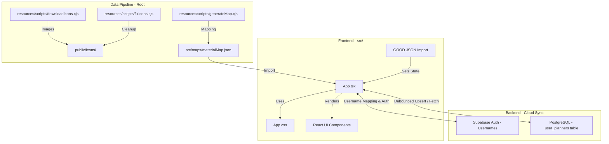

# Architecture: Genshin Planner

This document outlines the technical architecture, data flow, and design patterns of the Genshin Planner project.

## Tech Stack
- **Framework**: [Vite](https://vitejs.dev/) + [React](https://react.dev/)
- **Language**: [TypeScript](https://www.typescriptlang.org/)
- **Styling**: Vanilla CSS (Standard CSS variables for theming)
- **Icons**: [Lucide React](https://lucide.dev/)
- **Database & Auth**: [Supabase](https://supabase.com/) (Auth & PostgreSQL Database with JSONB support)
- **Deployment**: Optimized for Static Site Hosting (GitHub Pages) with CI/CD environment integration

## High-Level Architecture

## Core Components

### 1. Data Pipeline (`resources/scripts/*.cjs`)

- `resources/scripts/downloadIcons.cjs`: Fetches material icons from external sources.
- `resources/scripts/generateMap.cjs`: Aggregates material metadata (rarity, sources, names) into `src/maps/materialMap.json`.
- `resources/scripts/fixIcons.cjs`: Ensures icon consistency and proper file extensions.

### 2. State Management & Dual Persistence

State is centralized in `App.tsx` using React's `useState` hooks combined with a dual-persistence storage layer:
- **Unified State Structure**: Progression planning uses `plannedItems` (representing a unified list of both characters and weapons). On loading, legacy profiles containing only `planned_characters` are transparently migrated by appending `type: "character"` and converting them to `plannedItems`.
- **Offline Guest Mode**: When the user is logged out, the app functions purely offline. All state (materials, characters, weapons, artifacts, planned items) is read and saved locally using a single unified Local Storage namespace key: `genshin_planner_local_data`. In guest mode, the profile dropdown switcher is fully hidden.
- **Supabase Cloud Sync Mode**: When the user logs in, the app connects to the Supabase client. State is dynamically read from and saved to the cloud database table, debouncing database writes to prevent write limits and UI hiccups during intensive operations. To maintain backwards compatibility, the client syncs the character-only subset to `planned_characters` and the complete unified sequence to `planned_items`.

### 3. Authentication & Username Mapping Layer

To provide a seamless, email-free user experience, the planner uses a transparent username-to-email mapping pattern:
- **Registration & Sign-In**: The user registers and signs in using an alphanumeric Username (e.g. `daxiok`).
- **Internal Mapping**: In the client layer (`src/components/AuthModal.tsx`), input usernames are transparently converted to email addresses using the template `${username.trim().toLowerCase()}.planner@gmail.com`.
  > [!NOTE]
  > Using `@gmail.com` with a custom `.planner` suffix satisfies Supabase's mandatory MX record checks for new registrations without requiring actual emails.
- **Clean Representation**: All email details are kept completely hidden from the user interface. The header displays and parses the pure username (extracted by splitting the email at the `@` symbol).

### 4. Database Schema & Row Level Security

User profiles are stored in the Supabase PostgreSQL database under the `user_planners` table.

- **Schema Fields**:
  - `user_id` (UUID, references `auth.users` primary key): The account holder ID.
  - `profile_name` (TEXT): The unique label of the profile within the account (e.g. `Daxiok`, `Chise`).
  - `materials` (JSONB): Inventory mapping (material key -> counts).
  - `characters` (JSONB): Owned characters list.
  - `weapons` (JSONB): Owned weapons list.
  - `artifacts` (JSONB): Custom artifacts list.
  - `planned_characters` (JSONB): Target character planning cards (maintained for legacy client compatibility).
  - `planned_items` (JSONB): Unified planning array containing both character and weapon planning cards sequentially to preserve priorities and enable global inventory allocation.
  - `updated_at` (TIMESTAMP WITH TIME ZONE): Tracks modification times.
- **Keys & Triggers**:
  - Compound Primary Key: `(user_id, profile_name)` ensures multiple unique profiles can exist within the same account.
- **Row Level Security (RLS)**:
  - Enabled on `user_planners` to restrict reads, upserts, and deletes only to authenticated requests where `auth.uid() = user_id`.

### 5. Multi-Profile Switcher & Deletion Safety

A shared account can host multiple character configurations (e.g. your planner vs your partner's planner):
- **Dynamic Creation**: Users can create custom profiles on-demand via the dropdown menu. A capitalized profile is initialized with a blank state.
- **Row-Level Actions**: The dropdown profile rows host a selection action and a red hover trash icon (`Trash2`) for profile deletion.
- **Deletion Safety Boundary Check**: To prevent accounts from becoming profile-less, the deletion action is strictly safety-locked. The delete button is programmatically hidden and prevented if `profiles.length === 1`, ensuring the last remaining profile can never be deleted.

### 6. GOOD Data Format

The app is built around the **Genshin Optimizer Data (GOOD)** format.
- It maps lowercase internal keys (e.g., `creaturesurveyingnotes`) to human-readable names and game IDs via the `src/maps/materialMap.json`.

### 7. UI & Modal Navigation Flow
- **Modals Parity**:
  - `CharacterSelectionModal` / `WeaponSelectionModal`: Renders owned characters/weapons with current stats (levels, constellation talents, or refinements), filtering by category and rarity.
  - `CharacterTargetModal` / `WeaponTargetModal`: Handles the configuration of current and desired states.
- **Sequential Back Navigation**: When canceling/closing a target modal via the close button, the UI returns to the selection modal seamlessly rather than dismissing entirely to the dashboard, enhancing user workflow.
- **Planner Back Redirection Flow**: If a target modal is launched directly from a Planner card (via the Edit button), closing or canceling the modal redirects back to the Planner tab (`openedTargetFromPlanner` logic), bypassing the selection modal.
- **Planner Card Dual Controls & Headers**:
  - **Edit Button**: Launches the target modal for the designated planned item.
  - **Upgrade Button**: Launches an editable, multi-stage upgrade/crafting wizard.
  - **Power Toggle**: Puts planning on standby (grayscale/opacity overlay across the *entire* card header and body, excluding material totals from requirements) or reactivates plans.
  - **Delete Button**: Discards the planned card.
  - **Draggable Title Affordance**: Clicking and dragging the card's header bar initiates a native HTML5 drag event to reorder elements.

### 9. Priority Manager Modal & Reordering Grid Flow

The app features two robust ways to reorder progression cards and customize priority weighting across a mixed list of characters and weapons:
- **Unique Item Identities**:
  - *Characters* are unique in the game and identified by their unique string key (e.g. `Furina`).
  - *Weapons* are not unique; duplicate plans can exist. Weapons are uniquely identified in the planner using a dynamic ID schema: `weapon:${weaponIndex}`, mapping to their index in the user's owned weapons array.
- **Priority Manager Modal (`PriorityManagerModal.tsx`)**:
  - Launches from the header tab's "Manage Priority" action button.
  - Hosts a vertical list of mixed planned items (characters and weapons). Standby cards (`enabled === false`) are styled in a faded state. Weapons display their custom avatar, refinement badge, and rarity borders.
  - Dragging rows swaps their visual draft order immediately for real-time feedback.
  - Order numbers next to elements remain unchanged (representing the original *saved* order) during draft swaps, only updating to reflect the new sequence once the user clicks "Save".
- **Direct Grid Card Drag-and-Drop**:
  - **Header-Only Restriction**: Card dragging can only be initiated by clicking and dragging on the card's title/name bar, preventing conflicts with buttons, scrollbars, or text selections in the body.
  - **Horizontal Split Drops**: Calculates the mouse coordinates relative to the target card's bounding box. Hovering on the left half overlays a glowing golden border on the left (`drop-before` pseudo-element) to insert the card *before* the target; hovering on the right half overlays a gold border on the right (`drop-after` pseudo-element) to insert it *after* the target.
  - **Reordering Utilities (`src/utils/plannerHelpers.ts`)**:
    - `reorderByKeys(items, orderedKeys)`: Re-sequences elements by matching keys.
    - `moveItem(items, fromKey, toKey, placement)`: Inserts elements at specified positions based on target coordinates.
  - **State Autosave**: Drag reordering updates the unified `planned_items` array directly, triggering the standard debounced LocalStorage/Supabase cloud background sync to persist changes permanently.

### 8. Editable Item Upgrade & Crafting Flow (`src/utils/upgradeHelpers.ts`, `src/components/*Modal.tsx`)

The instant upgrade confirm dialog is replaced by a two-stage alchemical and resource reconciliation workflow:
- **Alchemical Calculation Engine (`upgradeHelpers.ts`)**:
  - *Top-Down Propagation*: Calculates material shortages starting at the highest tier and recursively propagates missing amounts as demands ($3 \times$ ingredients) to lower-rarity tiers.
  - *Bottom-Up Simulation*: Resolves conversions to craft exactly what is missing, falling back to the maximum possible conversion if inventory is insufficient. Covers groups `100` (monster drops), `400` (talent books), `500` (gemstones), and `600` (weapon domain ascension materials).
  - *Deduction & Clamping*: Performs the final subtraction of base requirements and consumed craft ingredients, adds manual crafting bonuses, and clamps inventory counts at `0`.
- **Upgrade Customization Modals (`UpgradeCharacterModal.tsx` / `UpgradeWeaponModal.tsx`)**:
  - *Target Level Selectors*: Houses dynamic controllers for level targets (and talents for characters, displaying constellation boosts in light blue), updating calculations in real-time.
  - *Live Materials Calculator*: Renders progress bars formatted as `#Owned / #Required` (clamped if sufficient). Estimated cards (Mora, Hero's Wit, and Mystic Enhancement Ore) are formatted as `#Owned / ~#Required` and dynamically switch to green/red borders based on equivalent sufficiency.
  - *Craft Panel*: Filters and lists only active conversions with `count > 0`.
  - *Crafting Bonus Panel*: Displays all tiers of talent, weapon, or monster drops in active chains, allowing manual entry of double yield bonuses.
- **Mora, EXP & Ore Correction Modals (`UpgradeEstimateCorrectionModal.tsx` / `WeaponUpgradeEstimateCorrectionModal.tsx`)**:
  - Prompts the user to verify/correct estimated resource remaining values before final mutation.
  - Uses `calculateRemainingExpBooks` or `calculateRemainingOres` to greedily deduct resources from highest to lowest tier (Hero's Wit ➔ Adventurer's ➔ Wanderer's or Mystic ➔ Fine ➔ Enhancement Ore).

## Design Patterns

- **Local-First with Cloud Sync**: All processing and rendering occur dynamically on the client, with background syncing to Supabase for authenticated users, combining low-latency responses with multi-device persistence.
- **Top-Down & Bottom-Up Alchemical Cascading**: Separates the requirement propagation phase (top-down) from alchemical conversion execution (bottom-up), allowing exact tracking of crafted items and inventory consumption without cascading surplus explosion.
- **Equivalent EXP Sufficiency Evaluation**: Hero's Wit sufficiency is calculated across all three tiers of EXP books (Hero's Wit = 20k, Adventurer's = 5k, Wanderer's = 1k). If the equivalent EXP is sufficient, the Hero's Wit card displays as green with clamped progress (`#Required / ~#Required`), and the deficit is greedily subtracted from lower-tier books.
- **Dynamic Rarity Styling**: CSS variables are used for rarity-based background colors (`bg-rarity-1` through `bg-rarity-5`). Additionally, planner card nameplate headers dynamically shift their linear background gradients based on character database rarity: a signature purple (`#7b6a99`) for 4★ characters and a signature gold-brown (`#8c6a4a`) for 5★ characters.
- **High-Density Compact Grid Layout**: Material grids in planner cards render as highly dense grids utilizing `50px` width cells with a strict aspect ratio. Numbers are structured cleanly above the graphic assets, maximizing display room (supporting 5+ columns per row).
- **Centered Artwork Crop Zoom**: To isolate transparent margins of standard asset files, material images employ `transform: scale(1.35)` and `transform-origin: center` properties, with the parent boundaries clipped via `overflow: hidden`, guaranteeing highly focused in-game artwork.
- **Strict Domain Material Sorting**: Calculations and grids strictly sort required materials by game category (Mora ➔ XP ➔ Gems ➔ Specialties ➔ Drops ➔ Boss ➔ Weekly ➔ Crowns), maintaining domain expectations.
- **Lazy Mapping**: The app merges static metadata (`materialMap`) with dynamic user data (`materials`) at render time.
- **Constellation Boost Presentation Pattern**: To mirror native game behavior, talent levels displayed in selection and input screens are dynamically adjusted (+3 to Elemental Skill for C3+, +3 to Elemental Burst for C5+). These are visually highlighted with a premium sky blue theme. In the input controllers, the UI maps display values back to standard **base** talent levels before state storage, ensuring calculations and schema are cleanly separated from constellation logic.
- **Locked Center Grid Page Header Navigation**: Swaps the `.header` from a flexbox layout to a 3-column CSS Grid (`1fr auto 1fr`). This forces the tab navigation links to sit strictly in the mathematical center of the viewport. Sync controls are aligned right via `justify-content: flex-end` and `justify-self: end`. When the cloud sync badge sizes change dynamically during saving operations, the width differences are swallowed within the right column and do not shift the center tabs.
- **Dynamic Header Text Scaling & Aligned Leveled Cards**: Planner grid cards keep their headers strictly aligned at a fixed `height: '46px'` to maintain a visually unified grid level. Very long character and weapon names are gracefully wrapped and fitted using dynamic font scaling (`fontScale` of `0.8rem` vs `0.95rem` vs `1.15rem` based on character length) and multiline clamp styles (`display: '-webkit-box'`, `WebkitLineClamp: 2`, `lineHeight: '1.15'`), preventing overlapping or out-of-bounds spillages.
- **Planner Tab Default Landing State**: The initial tab state defaults to `'planner'` rather than `'inventory'`, prioritizing active visual progression cards immediately upon page loads and browser refreshes.
- **Contiguous Badge Filter Groups with Locked Geometry**:
  * Unified segment filter groups are wrapped inside a contiguous `.filter-button-group` flexbox container, sharing borders perfectly.
  * Static button widths (`96px`/`92px`/`88px`/`110px`/`135px`) and a locked `.badge-count-pill` width (`44px`) are strictly enforced via `!important` overrides in `App.css` to freeze filter positions and eliminate layout shifts when selection states update.
  * Subtle transparent backgrounds (`rgba(X, Y, Z, 0.15)`) glow beautifully with solid bottom borders matching their respective themed elements, preserving high-fidelity native icons without stencils.
- **Multi-Tier Level sorting Cascade (Level > Rarity > Alphabetic)**:
  * Restructures characters list ordering under a three-tiered tie-breaking rule. Sharing identical levels delegates sorting to native character rarity (respecting the active sort order multiplier), and then to display names alphabetically (A-Z ascending) for clean visual grids.
- **Weapon Selection UI Parity & Overlays**:
  * *Layout Parity*: Shares the `.char-select-grid`, `.char-select-item`, and `.char-select-name` styling directly with character selection grids.
  * *Gold Refinement Badges*: Displays refinement gold badges (`R1`-`R5` themed with `#ffcc66`) positioned dynamically in the top-left of the icon box using `.char-select-level-container`.
  * *Equipped Character Banners*: Overlays a semi-translucent dark badge at the bottom-center of the icon wrapper (`.material-icon-wrapper`) indicating the name of the equipped character using that weapon, hiding the badge entirely for unequipped inventory weapons.
  * *Silent Silhouette Filters*: Weapon category filters use standard web icons with a CSS silhouette filter (`brightness(0) invert(1)`) to display a crisp soft-white in the inactive state and a warm sepia/gold glow when isolated/active.
  * *Search & Star/Abc Sorting Toggle*: Positions sorting toggles (`Star/Abc`) next to the top search bar, using Star as the default sort cascade.
  * *2-Line Text Name Wrapping*: Employs vertical Webkit clamping to wrap long weapon names to exactly two lines, centered cleanly, inside a fixed-height (`34px`) text wrapper to keep grid alignment perfectly straight.

### 11. Global Inventory Allocation & Summary Panel (`src/utils/plannerCalculator.ts`, `src/App.tsx`)

To handle complex resource planning across multiple items, the app implements a global sequential allocation engine:
- **Sequential Resource Consumption**: Materials and craftable stock are consumed sequentially based on the active priority order of the planner cards. High-priority cards consume available inventory first, and subsequent cards plan around the remaining quantities, preventing double-counting of resources.
- **Left-Side Summary Panel**: A dynamic panel rendered on the Planner page that compiles aggregate totals of missing materials across all enabled progression plans.
- **Domain Schedule Mapping**: The Summary panel maps missing materials to their respective weekly in-game domains, enabling players to see at a glance which days they need to farm (e.g., Monday/Thursday, Tuesday/Friday, Wednesday/Saturday).
- **Reactive Recalculations**: All allocation states, sufficiency highlights (green/red borders), and summary listings are updated instantly in the UI when planner items are reordered, toggled on/off, or edited.

## Directory Structure

- `/src`: React components, hooks, Supabase configuration, and material maps.
- `/public`: Static assets including the processed `/icons` folder.
- `/resources`: Data processing scripts and architecture documentation.
- `/`: Configuration files, linting guidelines, environment setups, and workflow builds.

