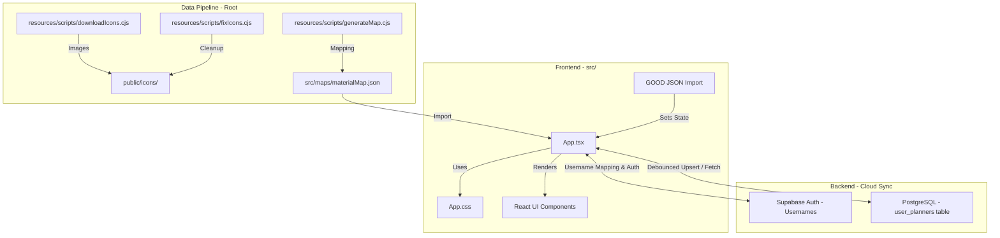

# Architecture: Genshin Planner

This document outlines the technical architecture, data flow, and design patterns of the Genshin Planner project.

## Tech Stack
- **Framework**: [Vite](https://vitejs.dev/) + [React](https://react.dev/)
- **Language**: [TypeScript](https://www.typescriptlang.org/)
- **Styling**: Vanilla CSS (Standard CSS variables for theming)
- **Icons**: [Lucide React](https://lucide.dev/)
- **Database & Auth**: [Supabase](https://supabase.com/) (Auth & PostgreSQL Database with JSONB support)
- **Deployment**: Optimized for Static Site Hosting (GitHub Pages) with CI/CD environment integration

## High-Level Architecture

## Core Components

### 1. Data Pipeline (`resources/scripts/*.cjs`)

- `resources/scripts/downloadIcons.cjs`: Fetches material icons from external sources.
- `resources/scripts/generateMap.cjs`: Aggregates material metadata (rarity, sources, names) into `src/maps/materialMap.json`.
- `resources/scripts/fixIcons.cjs`: Ensures icon consistency and proper file extensions.

### 2. State Management & Dual Persistence

State is centralized in `App.tsx` using React's `useState` hooks combined with a dual-persistence storage layer:
- **Offline Guest Mode**: When the user is logged out, the app functions purely offline. All state (materials, characters, weapons, artifacts, planned characters) is read and saved locally using a single unified Local Storage namespace key: `genshin_planner_local_data`. In guest mode, the profile dropdown switcher is fully hidden.
- **Supabase Cloud Sync Mode**: When the user logs in, the app connects to the Supabase client. State is dynamically read from and saved to the cloud database table, debouncing database writes to prevent write limits and UI hiccups during intensive operations.

### 3. Authentication & Username Mapping Layer

To provide a seamless, email-free user experience, the planner uses a transparent username-to-email mapping pattern:
- **Registration & Sign-In**: The user registers and signs in using an alphanumeric Username (e.g. `daxiok`).
- **Internal Mapping**: In the client layer (`src/components/AuthModal.tsx`), input usernames are transparently converted to email addresses using the template `${username.trim().toLowerCase()}.planner@gmail.com`.
  > [!NOTE]
  > Using `@gmail.com` with a custom `.planner` suffix satisfies Supabase's mandatory MX record checks for new registrations without requiring actual emails.
- **Clean Representation**: All email details are kept completely hidden from the user interface. The header displays and parses the pure username (extracted by splitting the email at the `@` symbol).

### 4. Database Schema & Row Level Security

User profiles are stored in the Supabase PostgreSQL database under the `user_planners` table.

- **Schema Fields**:
  - `user_id` (UUID, references `auth.users` primary key): The account holder ID.
  - `profile_name` (TEXT): The unique label of the profile within the account (e.g. `Daxiok`, `Chise`).
  - `materials` (JSONB): Inventory mapping (material key -> counts).
  - `characters` (JSONB): Owned characters list.
  - `weapons` (JSONB): Owned weapons list.
  - `artifacts` (JSONB): Custom artifacts list.
  - `planned_characters` (JSONB): Target planning cards and level boosts.
  - `updated_at` (TIMESTAMP WITH TIME ZONE): Tracks modification times.
- **Keys & Triggers**:
  - Compound Primary Key: `(user_id, profile_name)` ensures multiple unique profiles can exist within the same account.
- **Row Level Security (RLS)**:
  - Enabled on `user_planners` to restrict reads, upserts, and deletes only to authenticated requests where `auth.uid() = user_id`.

### 5. Multi-Profile Switcher & Deletion Safety

A shared account can host multiple character configurations (e.g. your planner vs your partner's planner):
- **Dynamic Creation**: Users can create custom profiles on-demand via the dropdown menu. A capitalized profile is initialized with a blank state.
- **Row-Level Actions**: The dropdown profile rows host a selection action and a red hover trash icon (`Trash2`) for profile deletion.
- **Deletion Safety Boundary Check**: To prevent accounts from becoming profile-less, the deletion action is strictly safety-locked. The delete button is programmatically hidden and prevented if `profiles.length === 1`, ensuring the last remaining profile can never be deleted.

### 6. GOOD Data Format

The app is built around the **Genshin Optimizer Data (GOOD)** format.
- It maps lowercase internal keys (e.g., `creaturesurveyingnotes`) to human-readable names and game IDs via the `src/maps/materialMap.json`.

### 7. UI & Modal Navigation Flow
- `CharacterSelectionModal`: Renders owned characters with their current level and constellation-boosted talents.
- `CharacterTargetModal`: Handles the setting of current and desired character states.
- **Sequential Back Navigation**: When canceling/closing the `CharacterTargetModal` via the close button, the UI returns to the `CharacterSelectionModal` seamlessly rather than dismissing entirely to the dashboard, enhancing user workflow.

## Design Patterns

- **Local-First with Cloud Sync**: All processing and rendering occur dynamically on the client, with background syncing to Supabase for authenticated users, combining low-latency responses with multi-device persistence.
- **Dynamic Theming**: CSS variables are used for rarity-based background colors (`bg-rarity-1` through `bg-rarity-5`).
- **Lazy Mapping**: The app merges static metadata (`materialMap`) with dynamic user data (`materials`) at render time.
- **Constellation Boost Presentation Pattern**: To mirror native game behavior, talent levels displayed in selection and input screens are dynamically adjusted (+3 to Elemental Skill for C3+, +3 to Elemental Burst for C5+). These are visually highlighted with a premium sky blue theme. In the input controllers, the UI maps display values back to standard **base** talent levels before state storage, ensuring calculations and schema are cleanly separated from constellation logic.

## Directory Structure

- `/src`: React components, hooks, Supabase configuration, and material maps.
- `/public`: Static assets including the processed `/icons` folder.
- `/resources`: Data processing scripts and architecture documentation.
- `/`: Configuration files, linting guidelines, environment setups, and workflow builds.

